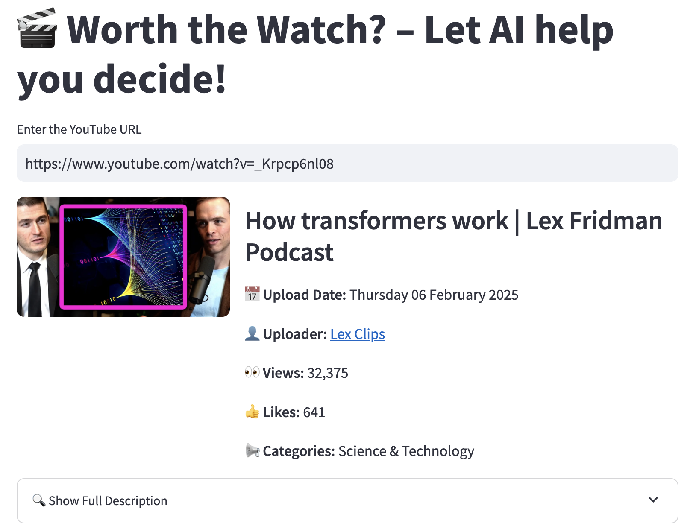

# Worth the Watch?

## 🌜 Worth the Watch? – Let AI Decide if It’s Worth Your Time!

### 🎮 What is this?
Ever clicked on a **30-minute YouTube video** only to realise it was a **waste of time**?  
**"Worth the Watch?"** is a prototype AI-powered **video summarisation tool** that helps you decide **whether to watch a video before you sink your time into it**  based on reading a (hopefully) condensed blurb

It uses **Google Gemini AI** and **yt-dlp** to:
- **Extract video metadata** (title, uploader, views, likes, etc.)
- **Summarise the video** based on its content
- **Give you a quick preview** so you can **watch smarter!**

---

## ⚙️ How It Works
1. **Enter a YouTube URL** into the app.  
2. The system **fetches metadata** (title, uploader, views, etc.) using **yt-dlp**.  
3. If available, it **extracts the transcript** for more accurate summaries.  
4. It sends this data to **Gemini AI**, which generates a **structured summary**.  
5. You get a **quick, AI-powered preview**—so you can decide whether it's worth watching!  

---

## What it uses

| **Component**   | **Description** |
|----------------|----------------|
| 🧠 **Google Gemini** | Used for **text summarisation** and structured outputs. |
| 🎮 **yt-dlp** | Extracts **YouTube metadata & transcripts**. |
| 🌍 **Streamlit** | Simple & interactive **frontend UI**. |
| 🔑 **dotenv (.env)** | Stores **API keys & credentials securely**. |
| 🛂 **requirements.txt** | Lists all **dependencies** to run the project. |

---

## 🔑 How to Set it Up

### Install Dependencies
```bash
pip install -r requirements.txt
```

### Get Your Gemini API Key
1. Go to **[Google AI Studio](https://aistudio.google.com/apikey)**.  
2. Generate an API key and **store it in a `.env` file** like this:

```ini
GEMINI_API_KEY=your-api-key-here
```

### Run the Streamlit App
```bash
streamlit run app.py
```

---

## Features
- **Quick Video Previews** – Summarises content before you watch.
- **AI-Powered Insights** – Extracts **key topics, timestamps, and speakers**.
- **Metadata Extraction** – Fetches **views, likes, and uploader details**.
- **Saves You Time** – or something like that

---